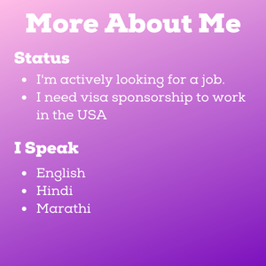
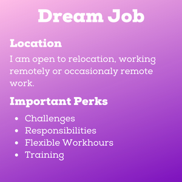
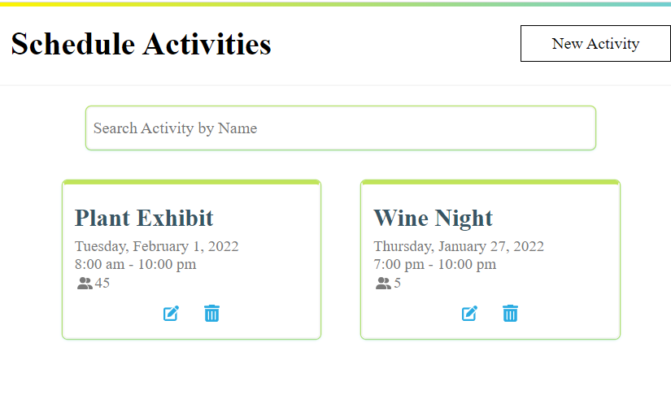
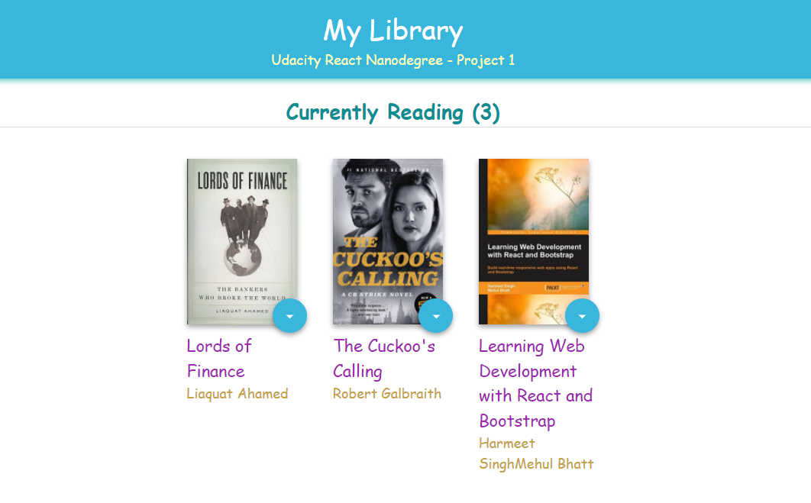
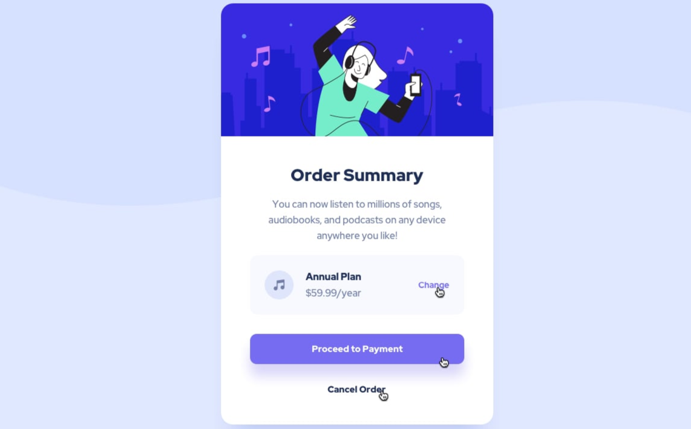

    <h1 align="center">
        <strong>Hi! I'm Snehal :blush:</strong>
    </h1>

    
    
    

:woman_office_worker: Pronouns: She/Her

<ul>
<li>:desktop_computer: Application Developer building business application using low-code/no-code platform CitizenDeveloper.</li>
<li>:mag: I enjoy developing application with ReactJS, HTML, CSS. To flourish in this stack I build personal projects.</li>
<li>:hammer_and_wrench: I am currently learning React Hooks and Unit Testing with Jest.</li>
<li>:people_holding_hands: I like working with diverse collaborative team, engaging with customers and learning new technologies.</li>
<li>:muscle: I am a Quick learner and a Risk Taker! I believe every problem has a solution. With this attitude, I always have found ways to solve any problem professionally or personally :smile:</li>
<li>:potted_plant: I absolutely love plants and flowers, I can talk about them all day long.</li>
<li>:thought_balloon: Ask me about journey in USA, learning to Code, projects, my love for plants, places I have travelled...my content. I am happy to connect!</li>
</ul>
 

    <h2 align="center">
        <strong>Languages</strong>
    </h2>
    

    
    
    
    
    
    
    

 

    
        

    <h2 align="center">
        <strong>My Projects</strong>
    </h2>

     
    
    
    
    
    

        
    

